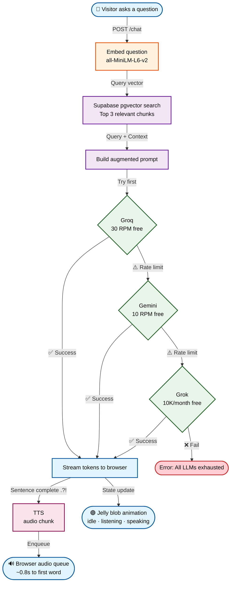

<div align="center">

# 👨🏻‍💻 Manish Portfolio API

**A production-grade RAG-powered portfolio assistant with streaming voice responses**

[](https://opensource.org/licenses/MIT)
[](https://www.docker.com/)
[](https://litellm.ai)
[](https://supabase.com)
[](https://huggingface.co/sentence-transformers/all-MiniLM-L6-v2)

</div>

---

## What This Is

This is the backend API powering the AI assistant on my personal portfolio. Visitors can ask natural language questions about my work, experience, and skills — and receive streaming answers spoken aloud with near-instant latency (~0.8 seconds to first word).

It uses a full **Retrieval-Augmented Generation (RAG)** pipeline so every answer is grounded in my actual portfolio content, not hallucinated. Voice responses are generated sentence-by-sentence as the LLM streams, keeping audio latency minimal.

---

## How It Works



**The key insight:** TTS fires per sentence as the LLM streams — not after the full answer is ready. This is what makes the first word play in under a second.

---

## API Endpoints

| Method | Endpoint | Description |
|--------|----------|-------------|
| `POST` | `/chat` | Main RAG endpoint. Accepts `{ query }`, streams LLM response. |
| `POST` | `/tts` | Converts a sentence to audio. Accepts `{ text }`, returns `audio/mpeg`. |
| `POST` | `/ingest` | Seeds the Supabase vector DB from knowledge base JSON. Protected by secret header. |
| `GET`  | `/health` | Health check. Returns `{ status: "ok" }`. |

### `/chat` request

```json
{
  "query": "What projects have you built?"
}
```

Response is a **streaming plain-text stream** — tokens arrive word by word, suitable for real-time UI rendering and sentence-level TTS.

### `/tts` request

```json
{
  "text": "I built a real-time delivery tracker using React and Socket.io."
}
```

Returns raw `audio/mpeg` bytes. Play directly with the Web Audio API.

---

## Tech Stack

| Layer | Technology | Why |
|-------|-----------|-----|
| **Embeddings** | `all-MiniLM-L6-v2` (Sentence Transformers) | Fast, free, runs locally — no API cost |
| **Vector DB** | Supabase `pgvector` | Free 500 MB tier, SQL-native, zero extra service |
| **LLM Gateway** | LiteLLM (self-hosted) | One interface for all providers, automatic fallback |
| **Primary LLM** | Groq · Mixtral-8x7b | 30 RPM free, fastest inference |
| **Fallback 1** | Google Gemini 2.5 Flash | 10 RPM free, high quality |
| **Fallback 2** | xAI Grok | 10K calls/month free |
| **TTS** | OpenAI `tts-1` | ~300ms per sentence, voice: `nova` |
| **Runtime** | Docker on Hugging Face Spaces | Free tier, persistent container |
| **Frontend** | Next.js on Vercel | Free tier, auto-deploy on push |

---

## Knowledge Base Structure

The RAG pipeline retrieves answers from structured portfolio content. Each entry follows this format:

```json
{
  "id": "proj_01",
  "type": "project",
  "title": "Real-time Delivery Tracker",
  "summary": "Live map dashboard for a logistics startup.",
  "stack": ["React", "Node.js", "Socket.io", "Mapbox"],
  "role": "Solo full-stack developer",
  "outcome": "Reduced dispatch calls by 40%",
  "content": "Real-time Delivery Tracker. Live map dashboard built with React, Node.js, Socket.io and Mapbox. Reduced dispatch calls by 40%."
}
```

The `content` field is what gets embedded. All other fields are metadata surfaced in the generated answer.

**Content types indexed:**

- `project` — portfolio projects with stack, role, and outcome
- `experience` — work history with responsibilities and achievements
- `skills` — tools and technologies grouped by category
- `about` — personal bio, focus area, and availability
- `faq` — pre-written Q&A pairs for common visitor questions
- `education` — degrees and certifications
- `contact` — links and preferred contact methods

---

## LiteLLM Fallback Configuration

LiteLLM sits between the API and the LLM providers. It automatically routes around rate limits — your code never changes, providers switch silently.

```yaml
# config.yaml
model_list:
  - model_name: chat
    litellm_params:
      model: groq/mixtral-8x7b-32768
      api_key: ${GROQ_API_KEY}

  - model_name: chat
    litellm_params:
      model: gemini/gemini-2.5-flash
      api_key: ${GEMINI_API_KEY}

  - model_name: chat
    litellm_params:
      model: xai/grok-2
      api_key: ${XAI_API_KEY}

router_settings:
  routing_strategy: usage-based-routing-v2
  fallbacks:
    - groq/mixtral-8x7b-32768:
        - gemini/gemini-2.5-flash
        - xai/grok-2
  num_retries: 2
```

Combined free tier capacity: **~50 concurrent portfolio visitors** handled for $0/month.

---

## Voice Latency Architecture

The critical design decision is **sentence-level TTS**, not paragraph-level.

```
❌  Naive approach:   full answer ready (3–8s) → single TTS call → audio plays
✅  This approach:    first sentence ready (0.4s) → TTS fires → audio plays (~0.8s)
                      second sentence ready → TTS fires → enqueued, plays seamlessly
                      ...continues until answer completes
```

The browser-side audio queue schedules each chunk using `Web Audio API`'s precise `startTime` so sentences play back-to-back with no gaps or overlaps.

---

## Running Locally

```bash
# Clone and install
git clone https://github.com/manish/portfolio-api
cd portfolio-api
pip install -r requirements.txt

# Set environment variables
cp .env.example .env
# Fill in: SUPABASE_URL, SUPABASE_SERVICE_KEY, OPENAI_API_KEY,
#          GROQ_API_KEY, GEMINI_API_KEY, XAI_API_KEY, INGEST_SECRET

# Start LiteLLM gateway
litellm --config config.yaml --port 4000 &

# Start API server
uvicorn main:app --reload --port 8000

# Seed the knowledge base (run once)
curl -X POST http://localhost:8000/ingest \
  -H "x-ingest-secret: your-secret" \
  -H "Content-Type: application/json" \
  -d @data/knowledge-base.json
```

---

## Environment Variables

| Variable | Description |
|----------|-------------|
| `SUPABASE_URL` | Your Supabase project URL |
| `SUPABASE_SERVICE_KEY` | Supabase service role key (not anon key) |
| `OPENAI_API_KEY` | Used for TTS (`tts-1`) only |
| `GROQ_API_KEY` | Primary LLM provider |
| `GEMINI_API_KEY` | Fallback LLM provider |
| `XAI_API_KEY` | Final fallback LLM provider |
| `INGEST_SECRET` | Protects the `/ingest` endpoint |

---

## Deployment

| Service | What runs there | Cost |
|---------|----------------|------|
| **Hugging Face Spaces** | This API (Docker container) | Free |
| **Vercel** | Next.js portfolio frontend | Free |
| **Supabase** | pgvector knowledge base | Free (500 MB) |
| **Groq / Gemini / Grok** | LLM inference | Free tier |
| **OpenAI** | TTS only | ~$2–3/month |

---

## Project Structure

```
portfolio-api/
├── main.py                  ← FastAPI app, route definitions
├── rag.py                   ← Embed → retrieve → augment → generate
├── tts.py                   ← Sentence-to-audio via OpenAI tts-1
├── ingest.py                ← One-time knowledge base seeding
├── config.yaml              ← LiteLLM provider + fallback config
├── Dockerfile               ← Container definition for HF Spaces
├── requirements.txt
├── data/
│   └── knowledge-base.json  ← Portfolio content (projects, bio, FAQs…)
└── .env.example
```

---

<div align="center">

Built by **Manish** · Powered by open-source tools · Deployed on Hugging Face Spaces

</div>
